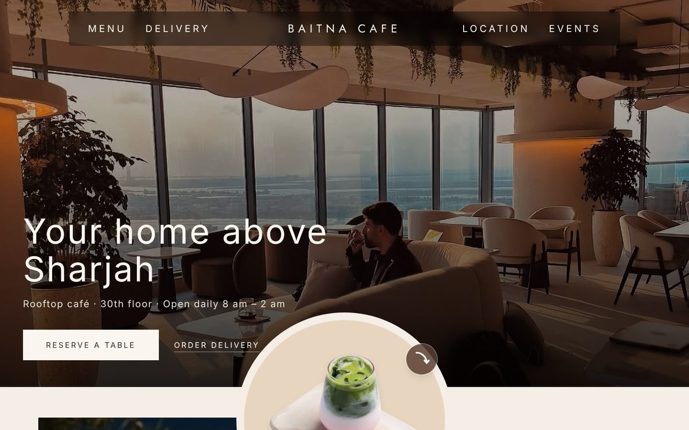
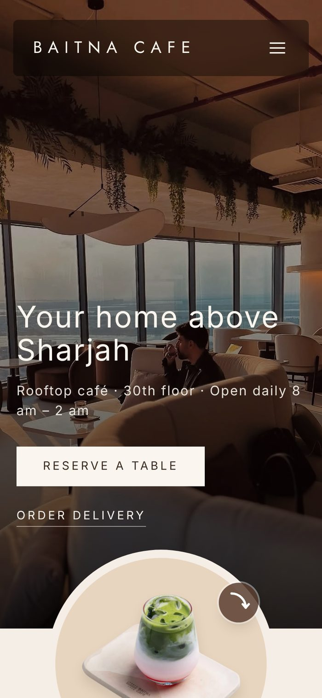
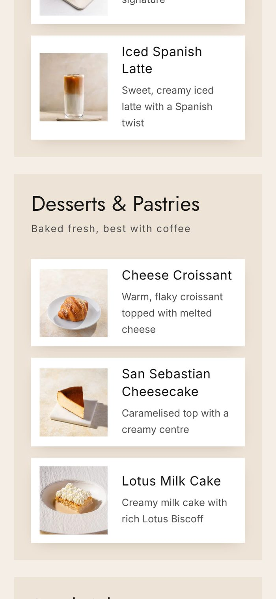
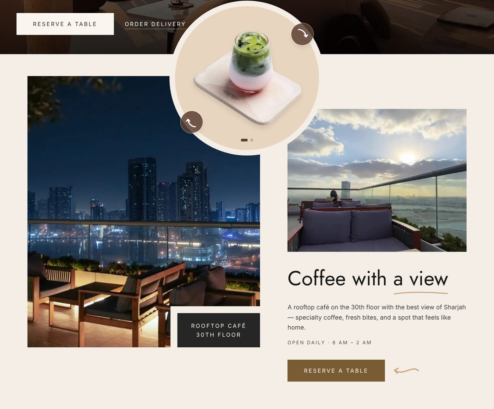
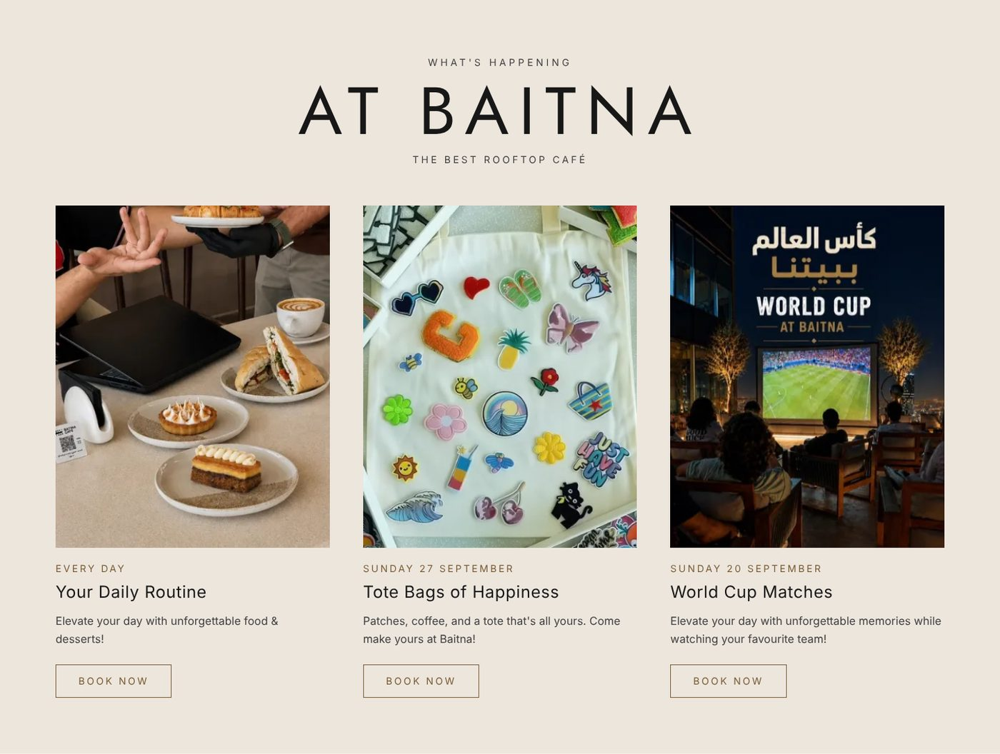
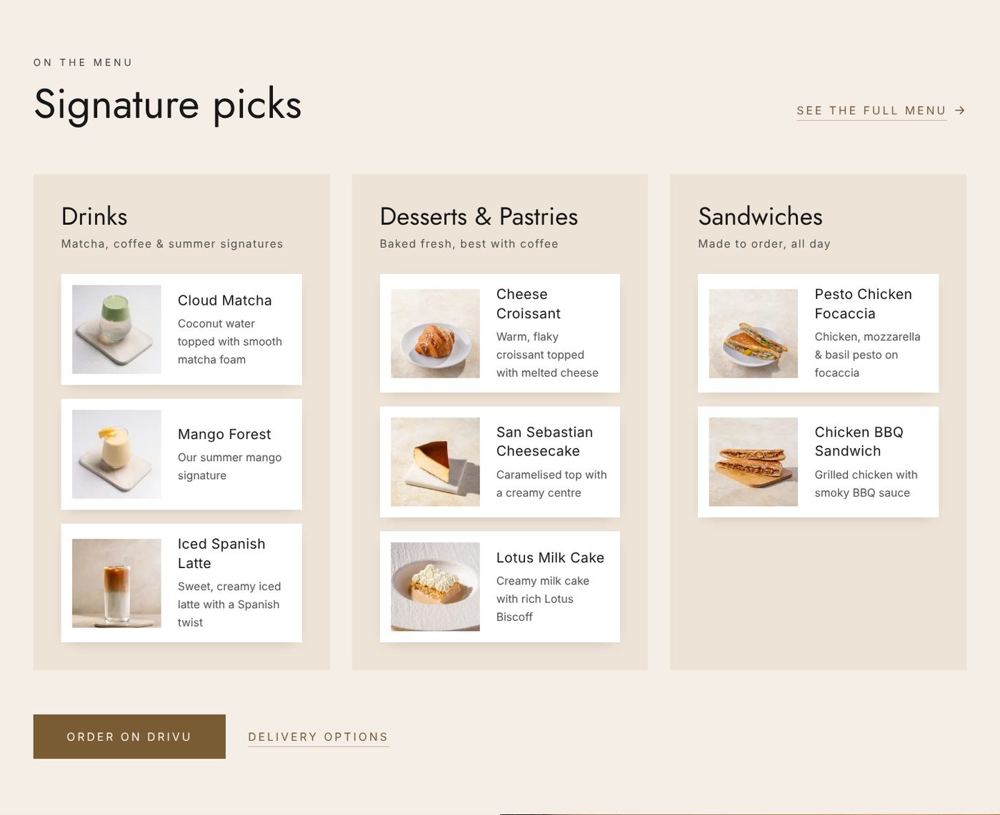
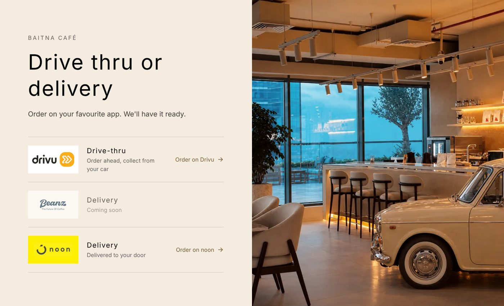
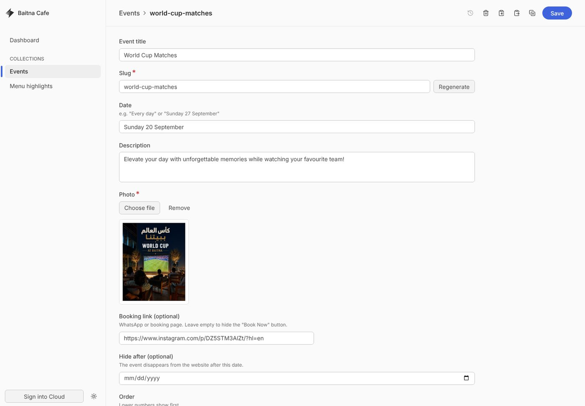

# Baitna Cafe — Website

A fast, mobile-first website for **Baitna Cafe**, a rooftop café on the 30th floor of Tabark Tower in Al Mamzar, Sharjah (UAE). Visitors can book a table, order delivery, see events and the signature menu, all from one page. The café's staff can update events and the menu themselves from a simple editor, with no developer needed.

**Live demo:** [baitna-cafe-pied.vercel.app](https://baitna-cafe-pied.vercel.app)

> **Concept project.** Designed and built independently by Nour Saneh as a proposal for the café. It is not the café's official website and is not affiliated with or endorsed by Baitna Cafe. Photos, menu items and branding belong to Baitna Cafe and are used here for demonstration only.



<p align="center">
  
  &nbsp;&nbsp;
  
</p>

---

## The problem

Baitna Cafe has a strong Instagram presence and is listed on delivery and booking apps, but no official website. Customers searching for the café land on scattered pages, and there is no single place with the hours, menu, location, events and booking.

## What the site does

| For customers | For the café |
|---|---|
| Hours, location and map at a glance | One official source of information online |
| **Reserve a table** in one tap (Dyne) | Bookings and orders go straight to the apps the café already uses |
| **Order** on Drivu (drive-thru) or noon (delivery) | Staff update events and menu from a browser — no code |
| Current events with "Book now" links | Past events hide themselves after their end date |
| Signature drinks, desserts and sandwiches | Staff can hide menu items without deleting them |
| Call or WhatsApp straight from the footer | Branded preview when the link is shared on WhatsApp or Instagram |

## Screenshots

**Coffee with a view** — the rooftop at night, a looping video of the café and a second "Reserve a table" button.


**Events** — managed by staff in the editor; cards stay centred whether there are one, two or more.


**Signature menu** — items, photos and order are editable; hidden items disappear from the site.


**Drive-thru and delivery** — every row is a direct link into the café's ordering apps.


**Staff editor** at `/admin` — events and menu are edited as simple forms and saved straight to the site.


## Highlights

- **Editable without a developer** — [Keystatic](https://keystatic.com) gives the café a visual editor for events and menu highlights. Saving commits to GitHub and the site redeploys automatically.
- **Fast on phones** — pages are pre-rendered as plain HTML. Images are resized and converted to WebP at build time (the largest photo went from 2.1 MB to 168 KB), and the café video was re-encoded from 5.8 MB to 3.3 MB with a poster frame.
- **Rich link previews** — an Open Graph image, title and description so shared links show a proper card on WhatsApp and Instagram.
- **Accessible** — keyboard focus styles, reduced-motion support, labelled controls, a mobile menu that closes with Escape, and a drink slider that only announces the visible item to screen readers.
- **Branded 404 page** — wrong or old links land on an on-brand page with routes back to the homepage, reservations and menu, kept out of search results.

## Tech stack

| | |
|---|---|
| Framework | [Astro](https://astro.build) |
| Styling | [Tailwind CSS](https://tailwindcss.com) v4 |
| Content editing | [Keystatic](https://keystatic.com) (Keystatic Cloud in production, local files in development) |
| Hosting | [Vercel](https://vercel.com) |
| Fonts | Jost (self-hosted via Fontsource) |

## Project structure

```
web/
├── src/
│   ├── components/      # Hero, nav, story, events, menu, ordering, footer
│   ├── content/         # Events and menu items (YAML, edited in Keystatic)
│   ├── data/business.ts # Café name, description and links
│   ├── layouts/         # Page shell and meta tags
│   └── pages/           # Homepage and 404 page
├── public/              # Favicon and Open Graph image
├── keystatic.config.ts  # Editor fields for events and menu
└── astro.config.mjs
```

## Running locally

Requires Node.js 22.12 or newer.

```sh
cd web
npm install
npm run dev        # http://localhost:4321  —  editor at /keystatic
npm run build      # production build
```

In development the editor saves to local files; in production it saves through Keystatic Cloud to this repository.

## Editing content

| What | Where |
|---|---|
| Events (title, date, photo, booking link, hide-after date) | `/admin` → Events |
| Menu highlights (name, category, note, photo, order, visibility) | `/admin` → Menu highlights |
| Site description, booking and menu links | `web/src/data/business.ts` |

## Author

Designed and developed by **Nour Saneh**.
